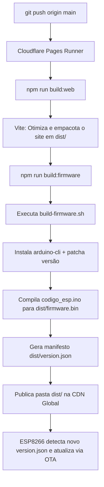

# 🔧 MakitaClicker — Guia Completo do Sistema

> **MakerSpace UNIFEI**  
> **Autores:** Nicolae Maximus T. N. Lopes · Victor Augusto de A. Silvério · Oliver Daniel Schiinke  
> **Link de Produção:** [https://makitaclicker.pages.dev](https://makitaclicker.pages.dev)  
> **API Serverless:** [https://makitaclicker.pages.dev/api/state](https://makitaclicker.pages.dev/api/state)  
> **Manifesto OTA:** [https://makitaclicker.pages.dev/version.json](https://makitaclicker.pages.dev/version.json)

---

## 📖 Visão Geral do Projeto

O **MakitaClicker** é um jogo incremental (*cookie clicker*) híbrido físico-digital. O objetivo do jogo é acumular "Makitas" até atingir a grande meta cósmica de **99 Bilhões (99B)**. 

O diferencial do projeto é sua integração completa entre hardware e web:
1. **Console Físico Autônomo:** Um microcontrolador **ESP8266 NodeMCU** com botão mecânico industrial de alta durabilidade e um display **LCD 20×4 I2C**. Funciona com latência de clique de 0ms, salva o progresso na memória flash interna (**LittleFS**), sincroniza pela internet via Wi-Fi e exibe em tempo real o **Top Player** ou o **Dono Temporário** no display com suporte a posse exclusiva via Web.
2. **Interface Web Moderna & Sistema de Perfis:** Roda em qualquer navegador (desktop ou mobile) na taxa de atualização nativa do monitor com cálculo via `dt`, perfis de usuário individuais instantâneos (sem senha), desduplicação automática de apelidos (`Nome`, `Nome 2`...), upload e recuperação transparente de perfis locais, auto-save a cada 3 minutos, botão manual de salvamento na nuvem, loja de oficinas, árvore tecnológica (*Skill Tree*) e telemetria de hardware.
3. **Backend Serverless Dual-Engine (Cloudflare D1 + KV):** Banco de dados relacional SQL no Cloudflare D1 como camada primária autoritativa (`100.000 gravações/dia` gratuitas nas tabelas `users`, `user_states`, `hardware_lease`, `ip_bans`) pareado com o Cloudflare KV para cache e redundância rápida.
4. **CI/CD e Firmware OTA Automático:** A cada `git push` no repositório GitHub, a Cloudflare compila a aplicação web e também compila o código C++ do ESP8266 via `arduino-cli`. A ESP baixa a nova versão de firmware pelo ar (Over-The-Air) automaticamente, sem necessidade de cabos.

---

## 🏗️ Arquitetura do Sistema

```
                        ┌────────────────────────────────────────┐
                        │      Cloudflare Edge CDN Global        │
                        │        makitaclicker.pages.dev         │
                        └───────────────────┬────────────────────┘
                                            │
               ┌────────────────────────────┼────────────────────────────┐
               │ HTTPS (Assets Estáticos)   │ HTTPS REST (/api/state)    │ HTTPS OTA (firmware.bin)
               ▼                            ▼                            ▼
    ┌──────────────────────┐    ┌──────────────────────┐    ┌──────────────────────┐
    │     Navegador        │    │ Cloudflare Functions │    │  ESP8266 NodeMCU     │
    │  (Desktop / Mobile)  │◀──▶│  + D1 SQL Primário   │◀──▶│  (Hardware Físico)   │
    │                      │    │  + KV Cache Rápido   │    │                      │
    │ - Taxa Nativa (dt)   │    │ (Dual-Engine 100k/d) │    │ - Display LCD 20x4   │
    │ - Perfis & Auto-Sync │    │ - users (D1 SQL)     │    │ - Dono / Top no LCD  │
    │ - Loja de Oficinas   │    │ - user_states (D1)   │    │ - Botão Físico (D5)  │
    │ - Árvore Tecnológica │    │ - hardware_lease (D1)│    │ - Flash LittleFS     │
    │ - Tomar ESP (Lease)  │    │ - ip_bans (D1 SQL)   │    │ - Auto-Update OTA    │
    │ - Aba Status & HW    │    │ - MAKITA_KV (Cache)  │    │ - BearSSL 2560/768   │
    └──────────────────────┘    └──────────────────────┘    └──────────────────────┘
```

---

## 📂 Estrutura de Diretórios

```
MakitaClicker/
│
├── web/                           # 🌐 Frontend Web (HTML5, CSS3, ES6+)
│   ├── index.html                 # Estrutura semântica e abas de navegação
│   ├── admin.html                 # Painel administrativo protegido por senha SHA-256
│   ├── admin.js                   # Lógica e autenticação da interface administrativa
│   ├── style.css                  # Folha de estilo centralizada (tema escuro industrial)
│   ├── game.js                    # Motor fluido na taxa nativa, perfis e telemetria
│   ├── images/                    # Sprites, favicons e ícones
│   └── README.md                  # Documentação detalhada da Web
│
├── functions/                     # ☁️ Backend Serverless (Cloudflare Pages Functions)
│   └── api/
│       └── state.js               # API REST /api/state, KV ratchet e controle de cota
│
├── firmware/                      # 🔌 Código-fonte e Hardware Embarcado
│   ├── codigo_esp/                # Firmware da ESP8266 NodeMCU
│   │   └── codigo_esp.ino         # Sketch C++ Arduino autônomo (LCD, LittleFS, OTA)
│   ├── projeto/                   # Arquivos de projeto de hardware (KiCad PCB)
│   ├── GAME_DESIGN.md             # Tabela de balanceamento, custos e fórmulas
│   └── README.md                  # Manual completo de hardware e pinagem
│
├── package.json                   # 📦 Configuração NPM (Scripts de Build)
├── vite.config.js                 # ⚡ Configuração do empacotador Vite (Frontend)
├── build-firmware.sh              # 🚀 Script de CI/CD que compila a ESP via arduino-cli
└── dist/                          # 📦 Pasta de saída final gerada após o build
```

---

## 🌐 Como Funciona o Site (`web/`)

O frontend foi desenvolvido com foco em alta performance, responsividade e desacoplamento modular completo:

1. **Ciclo Gráfico Fluido (`gameLoop`):**
   - Executa via `requestAnimationFrame` na taxa nativa de atualização da tela do jogador (sem limitação artificial a 60 FPS).
   - Calcula a produção passiva contínua pelo delta de tempo (`dt`), somando frações precisas de Makitas a cada quadro.
   - Atualiza o contador de saldo e a taxa de MPS continuamente para máxima fluidez visual.
2. **Sistema de Perfis & Salvamento na Nuvem:**
   - **Criação de Perfil Instantânea & Sanitização de Nomes:** Ao criar ou trocar de perfil, o apelido é sanitizado para ser 100% legível no display LCD HD44780 (remoção de acentos como `á`, `õ`, cedilha `ç`, ordinais `º`/`ª`, restringindo a `[a-zA-Z0-9 _-]` com até 16 caracteres).
   - **Desduplicação Automática de Apelidos:** Se vários jogadores utilizarem o mesmo nome, o sistema adiciona dinamicamente sufixos numéricos ordenados pela data de criação (`Pedro`, `Pedro 2`, `Pedro 3`...), preservando o nome original no perfil mais antigo.
   - **Recuperação e Auto-Upload de Perfis Locais:** Perfis criados offline ou em dispositivos móveis presentes no `localStorage` são detectados e enviados automaticamente ao Cloudflare D1/KV com seu progresso completo (saldo, oficinas e árvore de habilidades).
   - **Salvamento Automático & Manual Dual-Engine:** O progresso local é salvo no Cloudflare D1 (SQL relacional) e replicado no Cloudflare KV a cada 3 minutos, ou instantaneamente pelo botão **"💾 Salvar na Nuvem"**.
   - **Alerta de Saída (`beforeunload`):** Se houver progresso acumulado localmente há mais de 5 minutos sem salvamento na nuvem, o navegador exibe um popup de confirmação antes de fechar a aba.
   - **Barra de Perfil:** Exibe o nome do perfil ativo, botão para alternar de jogador e indicador visual com horário do último salvamento na nuvem.
3. **Renderização Otimizada com Throttling (6 FPS):**
   - Listas de compras, botões de oficinas e status de requisitos da árvore tecnológica são atualizados a ~6 FPS (ou imediatamente quando o estado fica *dirty*). Isso evita gargalos de repintura do DOM, mantendo o consumo de CPU abaixo de 1%.
4. **Abas de Navegação:**
   - **🌳 Melhorias Permanentes:** Árvore tecnológica (*Skill Tree*) com pré-requisitos visuais conectando nós pai e filho, multiplicadores globais aditivos e bônus de clique.
   - **📊 Estatísticas:** Total histórico produzido, oficinas ativas, multiplicadores e botão de **Reset Total**.
   - **📡 Status & Hardware:** Monitoramento ao vivo do microcontrolador físico e posse da máquina (veja abaixo).
5. **Aba "📡 Status & Hardware":**
   - **Posse Exclusiva da Máquina Físico-Digital (Hardware Lease):** Exibe quem é o dono temporário da ESP8266 física. Jogadores podem clicar em **"🕹️ Tomar ESP"** para assumir o controle físico por 3 minutos (180 segundos). O display LCD do laboratório passa a exibir o nome do jogador e o cronômetro regressivo.
   - **LED Pulsante:** Verde para ESP online (contato há menos de 90s), laranja se sem sinal recente, cinza se desconectada.
   - **Ping / Latência:** Medição em tempo real da conexão HTTP entre o navegador e os servidores da Cloudflare.
   - **Comparativo de Firmware:** Versão remota (`version.json`) vs. versão instalada no chip físico.
   - **Telemetria do Microcontrolador:** RSSI do sinal Wi-Fi (em dBm com classificação de qualidade), IP local na rede, Uptime (tempo de atividade) e RAM livre (Heap).
   - **Diagnóstico Dual-Engine (Cloudflare D1 + KV):** Indica se o banco SQL D1 e o cache KV estão ativos (`_storage: "D1+KV (Dual-Engine)"`).
   - **Proteção Anti-AutoClicker:** Monitoramento de cliques sintéticos (`isTrusted=false`), CPS > 28 ou cadência robótica uniforme. O usuário é suspenso por 5 minutos com registro no D1/KV (`ip_bans`) e resposta HTTP 429. O hardware físico da ESP é imune.
   - **Handshake de Reset:** Indica se há ordem de limpeza pendente aguardando confirmação da ESP.
   - **Botão "🔄 Atualizar Agora":** Dispara teste instantâneo de latência e sincronização de dados.

---

## 🔌 Como Funciona o Firmware (`firmware/codigo_esp/`)

A placa **ESP8266 NodeMCU** é 100% autônoma e opera sem necessidade de qualquer microcontrolador secundário:

1. **Clock a 160 MHz:** A CPU roda em frequência máxima (`system_update_cpu_freq(160)`) para processar requisições HTTPS com TLS moderno e desenhar o LCD sem atrasos.
2. **Botão Físico com Interrupção de Hardware (0 ms de Latência):** Monitorado via interrupção externa no pino **D5** (`attachInterrupt` em `FALLING` com `INPUT_PULLUP` e `ICACHE_RAM_ATTR`). Possui filtro de debounce de 25 ms em microssegundos e drenagem atômica no `loop()`. **Zero cliques perdidos**, mesmo durante requisições de rede HTTPS ou handshakes TLS.
3. **Display LCD 20×4 I2C a 400 kHz com Double-Buffering Estático & Sanitização:**
   - **I2C Fast Mode:** Barramento configurado para **400 kHz** (`Wire.setClock(400000)`), reduzindo a ocupação da CPU na transmissão em 75%.
   - **Zero Fragmentação de DRAM:** Utiliza buffers estáticos `char[21]` com `snprintf` e comparação por `strncmp`, sem nenhuma alocação dinâmica da classe `String` no caminho crítico.
   - **Tratamento de Caracteres (`sanitizarParaLCD`):** Converte caracteres acentuados e símbolos incompatíveis para ASCII simples (ex: `ç` vira `c`, `º` vira `o`), evitando caracteres corrompidos no LCD.
   - **Tela Principal (4 Linhas Transparentes e Diretas):**
     - **Linha 0 (Dono da ESP ou Líder Global):** Se a placa estiver em posse de um jogador via Web, exibe `Dono: <Nome> (MM:SS)`. Se estiver livre, exibe o líder geral atual do ranking com saldo: `1o: <Nome> (<Saldo>)`.
     - **Linha 1 (Saldo Atual):** Saldo de Makitas acumuladas no console (`Makitas: 125.4k MKT` ou `Makitas: 99B (META!)`).
     - **Linha 2 (Produção / Corte):** Taxa passiva e ganho por clique (`Prod: +15.0/s   (+1)`), alternando instantaneamente para `>> CORTE EFETUADO! <<` por 600 ms ao pressionar o botão.
     - **Linha 3 (Status Operacional ao Vivo):** Indica o estado exato da máquina: `Status: Ativo`, `Status: Offline`, `Status: Conectando`, `Status: Sincroniz.`, `Status: Apagando...`, `Status: Reset OK!` ou progresso do OTA (`>> GRAVANDO: XX% <<`).
4. **Reconexão Wi-Fi Rápida e Não-Bloqueante (Retry Infinito a cada 10s):**
   - Na inicialização, a ESP tenta conectar por no máximo 7 segundos. Se não conseguir, entra imediatamente em jogo no modo offline.
   - A cada 10 segundos, de forma totalmente assíncrona, tenta reconectar ao Wi-Fi sem travar o loop principal nem a leitura do botão.
   - O display reflete a tentativa alternando para `Status: Conectando` durante a negociação e revertendo para `Status: Offline` em caso de falha temporária.
5. **Persistência Flash com Wear-Leveling Shield (LittleFS):** O estado é salvo no arquivo `/gamestate.json` a cada 30 segundos, mas **apenas se houver alterações reais não salvas** (`isFlashDirty == true`). Evita gravações redundantes, **reduzindo o desgaste da flash SPI em mais de 90%**.
6. **Telemetria Contínua & Buffers Calibrados (BearSSL):** A ESP envia à nuvem seu IP, versão de firmware, RSSI Wi-Fi, Uptime e RAM livre a cada 2.0s (quando ativa com cliques) ou 3.5s (em repouso). Os buffers TLS BearSSL são calibrados em `2560` bytes (RX) e `768` bytes (TX) com timeout de `2500ms`. O backend devolve respostas enxutas (< 700 bytes) sem telemetria web desnecessária, prevenindo truncation TLS.
7. **Handshake de Reset Não-Bloqueante (Zero-Recursion):** O envio de confirmação (`resetAck: true`) é agendado no `loop()`, eliminando chamadas recursivas e protegendo a pilha contra *Stack Overflow*.

---

## 🤝 Handshake de Reset Latente e Consistência Eventual no D1/KV

Para evitar que o progresso seja restaurado acidentalmente no site por nós CDN da Cloudflare com propagação defasada (*eventual consistency*) ou enquanto a ESP8266 mantém um saldo antigo offline:

1. **Ordens de Reset Latentes no Cloudflare D1 e KV:**
   - Quando um reset global é emitido (no jogo ou no Painel Admin), a flag `resetPendingEsp: true` é gravada no banco com um `resetId`.
   - **A ordem é 100% latente:** ela **nunca desaparece** do servidor enquanto a ESP8266 física não responder com `resetAck: true`.
   - Enquanto o ACK não for recebido, o servidor rejeita sumariamente qualquer saldo, clique ou compra residual antiga enviada pela ESP.
2. **Execução e Confirmação no Hardware (ESP8266):**
   - Ao receber `resetOrder: true`, a ESP8266 atualiza o display para `Status: Apagando...`, zera a memória RAM, formata `/gamestate.json` no LittleFS, exibe `Status: Reset OK!` e envia imediatamente uma sincronização contendo `resetAck: true`.
   - Apenas ao processar esse ACK, o servidor desliga a flag de pendência (`resetPendingEsp = false`) e o LCD retorna para `Status: Ativo`.
3. **Geração e Validação de `resetEpoch` (Perfis Web):**
   - Ao resetar perfis web, o sistema grava uma nova marca temporal `resetEpoch = Date.now()`. Qualquer pacote de salvamento defasado de nós de borda é descartado como *stale write*.
4. **Isolamento de Saves vs. Hardware Global:**
   - O saldo de jogadores individuais nunca é sobrescrito por valores acumulados na memória da ESP8266 física (`gamestate`).

---

## 🔒 Painel Administrativo (`/admin.html`)

O painel administrativo permite gerenciar a base de dados de jogadores e o hardware sem expor endpoints desprotegidos.

- **URL de Acesso:** [https://makitaclicker.pages.dev/admin.html](https://makitaclicker.pages.dev/admin.html)
- **Senha de Administrador:** `ADMIN_PASSWORD`

> [!NOTE]
> A senha existe para proteger a integridade do jogo e evitar que jogadores apaguem acidentalmente o progresso uns dos outros. No código JavaScript, a senha é validada através de seu hash criptográfico SHA-256 (`c9a2abd67ad59717195e5d8a6f917ba5084d81af244b0a8d40c8b30f234742d7`) gerado localmente pelo navegador (`crypto.subtle.digest`), evitando o envio de senhas em texto puro.

### Funcionalidades do Painel:
- **Gerenciamento de Perfis:** Exibe tabela completa de perfis salvos no Cloudflare D1 e KV com ID, apelido (desduplicado), data de cadastro e progresso de Makitas.
- **Exclusão Segura:** Permite remover jogadores individualmente (com recálculo dinâmico do `topPlayer` líder) ou apagar toda a base de perfis com confirmação em duas etapas.
- **Reset do Console Físico:** Dispara a reinicialização de fábrica da telemetria e do progresso do hardware embarcado.

---

## ☁️ Como Funciona o Build Remoto (CI/CD na Cloudflare Pages)

Toda vez que você executa `git push origin main`, o pipeline no Cloudflare Pages roda automaticamente o comando `npm run build`:



### Detalhes das Etapas do Build:
1. **Frontend Web (Vite):** Empacota e minifica todo o código JavaScript e CSS, enviando os arquivos web de produção para a pasta `dist/`.
2. **Contagem de Versão:** Faz `git fetch --unshallow` e obtém a versão com base na contagem real de commits.
3. **Compilação Headless do Firmware:** O `arduino-cli` compila o código C++ para a arquitetura NodeMCU ESP8266 (`nodemcuv2`), injetando a nova versão em `#define CURRENT_FIRMWARE_VER`.
4. **Targeting Seguro e Checksum MD5:** Identifica deterministicamente o binário compilado, calcula o hash criptográfico MD5 e o tamanho exato em bytes, gerando `firmware.bin` e o manifesto `version.json` com validação de integridade.
5. **Deploy Imediato:** Os arquivos estáticos e as Cloudflare Functions entram no ar em escala global, acionando o auto-update nas placas físicas com barra de progresso no LCD.

---

## 🛠️ Como Editar e Personalizar

### 1. Alterar Credenciais do Wi-Fi
Abra [`firmware/codigo_esp/codigo_esp.ino`](firmware/codigo_esp/codigo_esp.ino) e modifique as linhas:
```cpp
const char* ssid     = "NOME_DA_SUA_REDE";
const char* password = "SENHA_DO_SEU_WIFI";
```
Faça o commit e push. Na próxima conexão, ou gravando manualmente via USB, a ESP conectará na nova rede.

### 2. Configurar Oficinas (Loja) e Árvore de Habilidades
As oficinas e tecnologias agora são centralizadas no arquivo [`game-config.json`](game-config.json) na raiz do repositório:
- **Configuração Única:** Edite os arrays `upgrades` (oficinas) e `skillTree` (tecnologias, requisitos, custos e `effects` dinâmicos) em [`game-config.json`](game-config.json).
- **Adicionado no Build:** Durante `npm run build` ou `npm run dev`, o arquivo é automaticamente empacotado no frontend ([`web/`](web/)), exportado como endpoint estático ([`dist/game-config.json`](dist/game-config.json)) e sincronizado com o backend serverless ([`functions/api/`](functions/api/)).
- **Firmware (se afetar a ESP):** Em caso de alterações em multiplicadores do chip autônomo, espelhe na struct `UPGRADE_CONFIGS` ou na função `recalculateStats()` em [`firmware/codigo_esp/codigo_esp.ino`](firmware/codigo_esp/codigo_esp.ino).

### 4. Testes Locais da Web
Para testar o site localmente com Hot Module Replacement, rode os comandos:
```bash
npm install
npm run dev
```
O Vite iniciará um servidor em `localhost`. O motor gráfico detectará o ambiente local e entrará em **Modo Simulador Offline**, permitindo testar todas as animações, árvores e cálculos sem necessidade de conexão com a API da Cloudflare.

---

## ⚡ Conexões Físicas do Hardware (Pinout)

| Dispositivo | Pino no Módulo | Pino na NodeMCU | Observações |
|---|---|---|---|
| **LCD 20×4 I2C** | **GND** | **GND** | Terra comum |
| **LCD 20×4 I2C** | **VCC** | **VV (ou VU)** | Alimentação 5V fornecida pela porta micro-USB |
| **LCD 20×4 I2C** | **SDA** | **D2 (GPIO 4)** | Linha de dados do barramento I2C |
| **LCD 20×4 I2C** | **SCL** | **D1 (GPIO 5)** | Linha de clock do barramento I2C |
| **Botão Físico** | **Pino A** | **D5 (GPIO 14)** | Configurado como `INPUT_PULLUP` |
| **Botão Físico** | **Pino B** | **GND** | Fecha o circuito no terra ao ser pressionado |

> **Nota sobre Alimentação:** O pino **VV** da NodeMCU é conectado diretamente ao VBUS da porta micro-USB (fornecendo 5V reais). O módulo LCD 20×4 requer 5V para o contraste correto do cristal líquido; alimentá-lo no 3V3 deixará o texto invisível ou fraco.

---

## 📜 Licença e Créditos

Desenvolvido com dedicação pelos membros do **MakerSpace UNIFEI**.  
Disponível para fins educacionais, acadêmicos e projetos de cultura maker.
