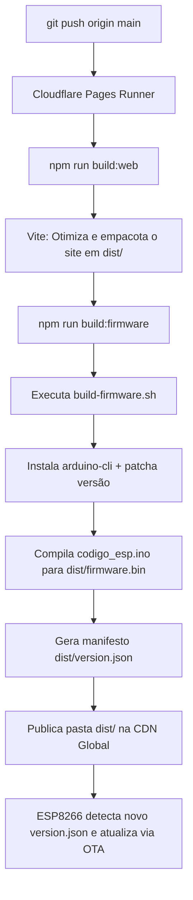

# 🔧 MakitaClicker — Guia Completo do Sistema

> **MakerSpace UNIFEI**  
> **Autores:** Nicolae Maximus T. N. Lopes · Victor Augusto de A. Silvério · Oliver Daniel Schiinke  
> **Link de Produção:** [https://makitaclicker.pages.dev](https://makitaclicker.pages.dev)  
> **API Serverless:** [https://makitaclicker.pages.dev/api/state](https://makitaclicker.pages.dev/api/state)  
> **Manifesto OTA:** [https://makitaclicker.pages.dev/version.json](https://makitaclicker.pages.dev/version.json)

---

## 📖 Visão Geral do Projeto

O **MakitaClicker** é um jogo incremental (*cookie clicker*) híbrido físico-digital. O objetivo do jogo é acumular "Makitas" até atingir a grande meta cósmica de **99 Bilhões (99B)**. 

O diferencial do projeto é sua integração completa entre hardware e web:
1. **Console Físico Autônomo:** Um microcontrolador **ESP8266 NodeMCU** com botão mecânico industrial de alta durabilidade e um display **LCD 20×4 I2C**. Funciona com latência de clique de 0ms, salva o progresso na memória flash interna (**LittleFS**) e sincroniza pela internet via Wi-Fi.
2. **Interface Web Moderna:** Roda em qualquer navegador (desktop ou mobile) a **60 FPS** com persistência em `localStorage`, loja de oficinas, árvore tecnológica de habilidades permanentes (*Skill Tree*) e aba exclusiva de telemetria em tempo real do hardware.
3. **Backend Serverless (Cloudflare Pages & KV):** Reconciliação contínua e tolerante a falhas (CRDT Ratchet Monotônico), garantindo que cliques físicos e virtuais somem ao mesmo saldo global sem perdas de progresso.
4. **CI/CD e Firmware OTA Automático:** A cada `git push` no repositório GitHub, a Cloudflare compila a aplicação web e também compila o código C++ do ESP8266 via `arduino-cli`. A ESP baixa a nova versão de firmware pelo ar (Over-The-Air) automaticamente, sem necessidade de cabos.

---

## 🏗️ Arquitetura do Sistema

```
                        ┌────────────────────────────────────────┐
                        │      Cloudflare Edge CDN Global        │
                        │        makitaclicker.pages.dev         │
                        └───────────────────┬────────────────────┘
                                            │
               ┌────────────────────────────┼────────────────────────────┐
               │ HTTPS (Assets Estáticos)   │ HTTPS REST (/api/state)    │ HTTPS OTA (firmware.bin)
               ▼                            ▼                            ▼
    ┌──────────────────────┐    ┌──────────────────────┐    ┌──────────────────────┐
    │     Navegador        │    │ Cloudflare Functions │    │  ESP8266 NodeMCU     │
    │  (Desktop / Mobile)  │◀──▶│   + Cloudflare KV    │◀──▶│  (Hardware Físico)   │
    │                      │    │   (Banco de Dados)   │    │                      │
    │ - Motor 60 FPS       │    └──────────────────────┘    │ - Display LCD 20x4   │
    │ - Loja de Oficinas   │                                │ - Botão Físico (D5)  │
    │ - Árvore Tecnológica │                                │ - Flash LittleFS     │
    │ - Aba Status & HW    │                                │ - Auto-Update OTA    │
    └──────────────────────┘                                └──────────────────────┘
```

---

## 📂 Estrutura de Diretórios

```
MakitaClicker/
│
├── web/                           # 🌐 Frontend Web (HTML5, CSS3, ES6+)
│   ├── index.html                 # Estrutura semântica e abas de navegação
│   ├── style.css                  # Folha de estilo centralizada (tema escuro industrial)
│   ├── game.js                    # Motor de jogo 60 FPS, render throttled e telemetria
│   ├── images/                    # Sprites, favicons e ícones
│   └── README.md                  # Documentação detalhada da Web
│
├── functions/                     # ☁️ Backend Serverless (Cloudflare Pages Functions)
│   └── api/
│       └── state.js               # API REST /api/state, KV ratchet e controle de cota
│
├── firmware/                      # 🔌 Código-fonte e Hardware Embarcado
│   ├── codigo_esp/                # Firmware da ESP8266 NodeMCU
│   │   └── codigo_esp.ino         # Sketch C++ Arduino autônomo (LCD, LittleFS, OTA)
│   ├── projeto/                   # Arquivos de projeto de hardware (KiCad PCB)
│   ├── GAME_DESIGN.md             # Tabela de balanceamento, custos e fórmulas
│   └── README.md                  # Manual completo de hardware e pinagem
│
├── package.json                   # 📦 Configuração NPM (Scripts de Build)
├── vite.config.js                 # ⚡ Configuração do empacotador Vite (Frontend)
├── build-firmware.sh              # 🚀 Script de CI/CD que compila a ESP via arduino-cli
└── dist/                          # 📦 Pasta de saída final gerada após o build
```

---

## 🌐 Como Funciona o Site (`web/`)

O frontend foi desenvolvido com foco em alta performance, responsividade e desacoplamento modular completo:

1. **Ciclo Gráfico a 60 FPS (`gameLoop`):**
   - Executa via `requestAnimationFrame`.
   - Calcula a produção passiva contínua pelo delta de tempo (`dt`), somando frações precisas de Makitas a cada quadro.
   - Atualiza o contador de saldo e a taxa de MPS a 60 FPS para máxima fluidez visual.
2. **Renderização Otimizada com Throttling (6 FPS):**
   - Listas de compras, botões de oficinas e status de requisitos da árvore tecnológica são atualizados a ~6 FPS (ou imediatamente quando o estado fica *dirty*). Isso evita gargalos de repintura do DOM, mantendo o consumo de CPU abaixo de 1%.
3. **Abas de Navegação:**
   - **🌳 Melhorias Permanentes:** Árvore tecnológica (*Skill Tree*) com pré-requisitos visuais conectando nós pai e filho, multiplicadores globais aditivos e bônus de clique.
   - **📊 Estatísticas:** Total histórico produzido, oficinas ativas, multiplicadores e botão de **Reset Total**.
   - **📡 Status & Hardware:** Monitoramento ao vivo do microcontrolador físico (veja abaixo).
4. **Aba "📡 Status & Hardware":**
   - **LED Pulsante:** Verde para ESP online (contato há menos de 90s), laranja se sem sinal recente, cinza se desconectada.
   - **Ping / Latência:** Medição em tempo real da conexão HTTP entre o navegador e os servidores da Cloudflare.
   - **Comparativo de Firmware:** Versão remota (`version.json`) vs. versão instalada no chip físico.
   - **Telemetria do Microcontrolador:** RSSI do sinal Wi-Fi (em dBm com classificação de qualidade), IP local na rede, Uptime (tempo de atividade) e RAM livre (Heap).
   - **Diagnóstico Cloudflare KV:** Indica se o banco está ativo e qual o binding em uso.
   - **Handshake de Reset:** Indica se há ordem de limpeza pendente aguardando confirmação da ESP.
   - **Botão "🔄 Atualizar Agora":** Dispara teste instantâneo de latência e sincronização de dados.

---

## 🔌 Como Funciona o Firmware (`firmware/codigo_esp/`)

A placa **ESP8266 NodeMCU** é 100% autônoma e opera sem necessidade de qualquer microcontrolador secundário:

1. **Clock a 160 MHz:** A CPU roda em frequência máxima (`system_update_cpu_freq(160)`) para processar requisições HTTPS com TLS moderno e desenhar o LCD sem atrasos.
2. **Botão Físico com Resposta de 0 ms:** Conectado ao pino **D5** (`INPUT_PULLUP`). Usa filtro de debounce por hardware/software de 25ms. O clique incrementa o saldo local na mesma fração de milissegundo, garantindo resposta tátil instantânea.
3. **Display LCD 20×4 I2C Inteligente:**
   - **Linha 0:** Título do jogo com animação do disco de serra giratório (alternando frames na memória CGRAM) e faíscas dinâmicas a cada clique.
   - **Linha 1:** Ícone de moeda/troféu e Saldo formatado em notação compacta (`k`, `M`, `B`, `T`, `Qa`).
   - **Linhas 2 e 3 (Exibição sem cortes do Site):** Como o domínio `makitaclicker.pages.dev` possui 23 caracteres, o firmware utiliza as Linhas 2 e 3 em conjunto (`Site: makitaclicker` e `      .pages.dev`), eliminando qualquer corte de texto.
   - **Telas Rotativas:** A cada 3,2 segundos, a Linha 3 alterna entre:
     1. Endereço completo do Site
     2. Progresso da Meta 99B (`Meta 99B: XX.XX%`)
     3. Total de Oficinas construídas
     4. Versão de Firmware (`FW: vXX (OTA Ativo)`)
     5. Endereço IP Local (`IP: 192.168.x.x`)
     6. MakerSpace UNIFEI
   - **Double-Buffering:** Só retransmite para o barramento I2C caracteres de linhas que realmente mudaram, eliminando qualquer cintilação (*flicker*).
4. **Persistência na Memória Flash (LittleFS):** O estado é salvo no arquivo `/gamestate.json` a cada 15 segundos ou antes de reiniciar. Se faltar energia, o saldo não se perde.
5. **Telemetria Contínua:** A cada 5 segundos, a ESP envia à nuvem seu endereço IP, versão de firmware instalada, RSSI de Wi-Fi, Uptime e RAM livre.

---

## 🤝 Handshake de Reset Bidirecional

Para evitar que o progresso seja resetado acidentalmente no site enquanto a ESP8266 mantém um saldo antigo offline (o que geraria ressurgimento do save):

1. Quando o jogador clica em **"⚠️ Resetar Todo o Progresso"** no site:
   - O Cloudflare KV zera o saldo e as melhorias e ativa a flag `resetPendingEsp: true` com um `resetId` incrementado.
2. A nuvem **continua emitindo a ordem de reset** em todas as respostas de sincronização para a ESP8266.
3. Ao receber `resetOrder: true`, a ESP8266:
   - Zera seu saldo e oficinas em RAM.
   - Apaga o arquivo `/gamestate.json` no LittleFS.
   - Exibe a mensagem de reset no LCD 20×4.
   - No próximo ciclo de sincronização, envia a confirmação `resetAck: true`.
4. Apenas quando a nuvem recebe o `resetAck: true` da ESP, a flag `resetPendingEsp` é desativada, encerrando o ciclo com segurança absoluta.

---

## ☁️ Como Funciona o Build Remoto (CI/CD na Cloudflare Pages)

Toda vez que você executa `git push origin main`, o pipeline no Cloudflare Pages roda automaticamente o comando `npm run build`:



### Detalhes das Etapas do Build:
1. **Frontend Web (Vite):** Empacota e minifica todo o código JavaScript e CSS, enviando os arquivos web de produção para a pasta `dist/`.
2. **Contagem de Versão:** Faz `git fetch --unshallow` e obtém a versão com base na contagem de commits.
3. **Compilação Headless do Firmware:** O `arduino-cli` compila o código C++ injetando a nova versão em `#define CURRENT_FIRMWARE_VER`, e salva `firmware.bin` em `dist/`.
4. **Deploy Imediato:** Os arquivos estáticos e as Cloudflare Functions entram no ar em escala global.

---

## 🛠️ Como Editar e Personalizar

### 1. Alterar Credenciais do Wi-Fi
Abra [`firmware/codigo_esp/codigo_esp.ino`](firmware/codigo_esp/codigo_esp.ino) e modifique as linhas:
```cpp
const char* ssid     = "NOME_DA_SUA_REDE";
const char* password = "SENHA_DO_SEU_WIFI";
```
Faça o commit e push. Na próxima conexão, ou gravando manualmente via USB, a ESP conectará na nova rede.

### 2. Adicionar ou Modificar Oficinas (Loja)
As oficinas devem ter suas configurações espelhadas para manter paridade entre Web, Cloud e ESP:
- **No Servidor:** [`functions/api/state.js`](functions/api/state.js) (array `UPGRADES`).
- **No Frontend:** [`web/game.js`](web/game.js) (array `upgrades`).
- **No Firmware:** [`firmware/codigo_esp/codigo_esp.ino`](firmware/codigo_esp/codigo_esp.ino) (struct `UPGRADE_CONFIGS`).

### 3. Adicionar Habilidades na Árvore Tecnológica
- Defina o nó no array `PERMANENT_UPGRADES` em [`functions/api/state.js`](functions/api/state.js) e [`web/game.js`](web/game.js), indicando `id`, `name`, `cost`, `req` (total acumulado necessário) e `parent` (habilidade pré-requisito).
- Se a habilidade tiver efeito na produção física da ESP, adicione a respectiva variável booleana em [`firmware/codigo_esp/codigo_esp.ino`](firmware/codigo_esp/codigo_esp.ino) dentro da função `recalculateStats()`.

### 4. Testes Locais da Web
Para testar o site localmente com Hot Module Replacement, rode os comandos:
```bash
npm install
npm run dev
```
O Vite iniciará um servidor em `localhost`. O motor gráfico detectará o ambiente local e entrará em **Modo Simulador Offline**, permitindo testar todas as animações, árvores e cálculos sem necessidade de conexão com a API da Cloudflare.

---

## ⚡ Conexões Físicas do Hardware (Pinout)

| Dispositivo | Pino no Módulo | Pino na NodeMCU | Observações |
|---|---|---|---|
| **LCD 20×4 I2C** | **GND** | **GND** | Terra comum |
| **LCD 20×4 I2C** | **VCC** | **VV (ou VU)** | Alimentação 5V fornecida pela porta micro-USB |
| **LCD 20×4 I2C** | **SDA** | **D2 (GPIO 4)** | Linha de dados do barramento I2C |
| **LCD 20×4 I2C** | **SCL** | **D1 (GPIO 5)** | Linha de clock do barramento I2C |
| **Botão Físico** | **Pino A** | **D5 (GPIO 14)** | Configurado como `INPUT_PULLUP` |
| **Botão Físico** | **Pino B** | **GND** | Fecha o circuito no terra ao ser pressionado |

> **Nota sobre Alimentação:** O pino **VV** da NodeMCU é conectado diretamente ao VBUS da porta micro-USB (fornecendo 5V reais). O módulo LCD 20×4 requer 5V para o contraste correto do cristal líquido; alimentá-lo no 3V3 deixará o texto invisível ou fraco.

---

## 📜 Licença e Créditos

Desenvolvido com dedicação pelos membros do **MakerSpace UNIFEI**.  
Disponível para fins educacionais, acadêmicos e projetos de cultura maker.
